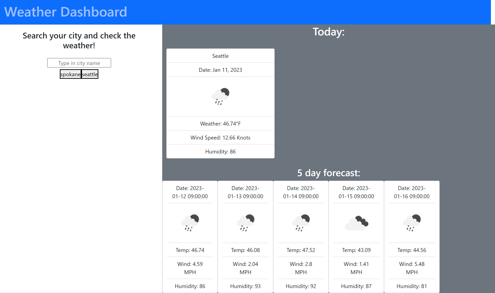

# Weather-Dashboard
A weather dashboard that shows the weather in a selected city using a third party API.

This app takes in the input of a city and runs it through the Openweathermap API to get a 5 day and current weather report. This report includes the temperature, wind speeds, and humidity.

In the javascript, the first function is called to receive past searches from local storage. In theory these searches should be stored in buttons underneath the search bar and be clickable to go to a past city. After a city is searched and submitted using the enter key, a function is called that will take the city and run it through the API to get current weather as well as lattitude and longitude. This lat and Long is used to call the 5 day forecast from the API in a new function. This function takes the array that is received and starts a for loop that creates new HTML elements for each card it appends.

Link to live application: https://bram-g.github.io/Weather-Dashboard/